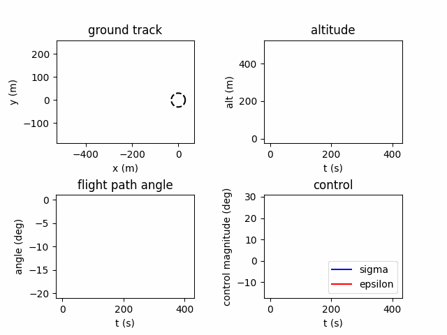

# Parafoil Control Testbed

Simulate and test controls algorithms for a parafoil.

## Examples

`simple_example.py`: use a Lyapunov-Dubins controller and graph output trajectory



## Installation
Make sure you are using Python version 3 or greater (`python --version` to check).

To install:
```bash
git clone <repository url>
cd parafoil-dynamics
python -m pip install -r requirements.txt # install scipy, matplotlib, alive_progress, and pyyaml
```

Or in a Python virtual environment
```bash
git clone <repository url>
cd parafoil-dynamics
python -m venv env
source env/bin/activate
python -m pip install -r requirements.txt
```

## Running
```python
python <filename> # for example: `python simple_example.py`
```

